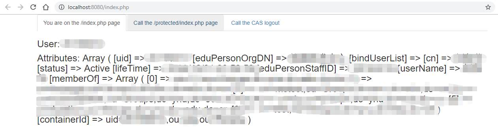

# php-cas-client-demo

### About
PHP demo using the phpCAS client (https://github.com/Jasig/phpCAS) to protect a web application. Install the dependency using Composer: `php composer.phar install`.

Use your favourite xAMP tool with **www** as the document root to start the webapp on **http://localhost:8080/**. The url 'protected/index.php' is protected and should trigger a CAS authentication.

Most of the configuration is defined in the **www/casconfig.php** file.

A specific logout application url is available at: http://localhost:8080/logout.php.

The YNU CAS server on [`http://ids.ynu.edu.cn/authserver`](http://ids.ynu.edu.cn/authserver).

### Some snapshot

